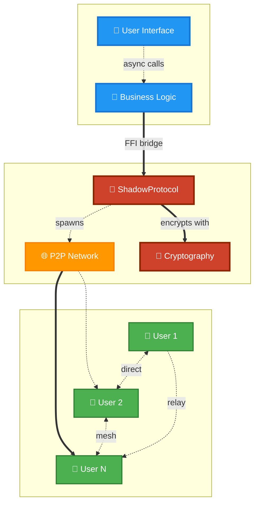

# 🌙 Shadow Ghost

> Decentralized P2P messenger focused on privacy and anonymity

---

  
  

  

---

##### [**README на русском**](README_RU.md)

## 📱 Description

**Shadow Ghost** is a modern P2P messenger that ensures complete communication privacy without using central servers. All data is transmitted directly between devices with end-to-end encryption.

### ✨ Key Features

- 🔒 **Complete Privacy** - no servers, no logs, no surveillance
- 🌐 **P2P Connections** - direct communication between devices
- 💬 **Text Messaging** - fast message exchange
- 📁 **File Sharing** - secure document exchange
- 🎤 **Voice Calls** - encrypted audio calls
- 🔐 **End-to-End Encryption** - protection of all data
- 🚀 **Cross-Platform** - Android, Windows, Linux

## 🏗️ Project Architecture

```mermaid
graph TB
    %% Стиль для более органичного вида
    classDef flutter fill:#2196F3,stroke:#1976D2,stroke-width:3px,color:#fff
    classDef rust fill:#CE422B,stroke:#8B2500,stroke-width:3px,color:#fff  
    classDef user fill:#4CAF50,stroke:#2E7D32,stroke-width:2px,color:#fff
    classDef network fill:#FF9800,stroke:#F57C00,stroke-width:2px,color:#fff

    subgraph " "
        direction TB
        UI["📱 User Interface"]:::flutter
        Logic["🧠 Business Logic"]:::flutter
    end
    
    subgraph "  "
        direction LR  
        Protocol["🔗 ShadowProtocol"]:::rust
        P2P["🌐 P2P Network"]:::network
        Crypto["🔐 Cryptography"]:::rust
    end
    
    subgraph "   "
        direction TB
        Peer1["👤 User 1"]:::user
        Peer2["👤 User 2"]:::user  
        Peer3["👤 User N"]:::user
    end
    
    %% Связи с изгибами
    UI -.->|"async calls"| Logic
    Logic ==>|"FFI bridge"| Protocol
    Protocol -.->|"spawns"| P2P
    Protocol ==>|"encrypts with"| Crypto
    
    %% P2P соединения (неровные)
    P2P ~~~ Peer1
    P2P -.-> Peer2
    P2P ==> Peer3
    
    %% Прямые P2P связи
    Peer1 <-.->|"direct"| Peer2
    Peer2 <-.->|"mesh"| Peer3  
    Peer1 -.->|"relay"| Peer3
```

## 🔒 Security

Shadow Ghost uses modern cryptographic algorithms:

- **AES-256** for message encryption  
- **RSA-4096** for key exchange  
- **SHA-256** for hashing  
- **QUIC protocol** for secure transmission  

---

## 🎯 Supported Platforms

| Platform  | Status   |
|-----------|----------|
| 🤖 Android | 🚧 Planned |
| 🪟 Windows | 🚧 Planned |
| 🐧 Linux   | 🚧 Planned |

---

## 🤝 Contributing

We welcome any contribution to the project development!

- 📋 Technical Documentation: [**`CONTRIBUTING.md`**](CONTRIBUTING.md)
- 🐛 Report Bug: [**Issues**](../../issues)
- 💡 Suggest Enhancement: [**Discussions**](../../discussions)

---

## 📄 License

This project is licensed under the [**Creative Commons Attribution-NonCommercial-ShareAlike 4.0 International License**](LICENSE).

---

## 🌟 Support the Project

If you like **Shadow Ghost**, please give it a ⭐ star!  

  

