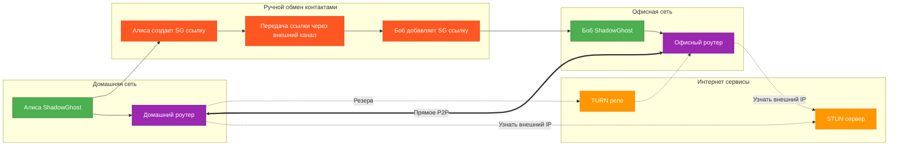

# 🌙 Shadow Ghost

> Децентрализованный P2P-мессенджер с упором на приватность и анонимность

---

  
  

  

---

##### [**README in English**](README.md)

## 📱 Описание

**Shadow Ghost** — это современный P2P-мессенджер, обеспечивающий полную приватность общения без использования центральных серверов. Все данные передаются напрямую между устройствами с применением сквозного шифрования.

### ✨ Ключевые особенности

- 🔒 **Полная приватность** — без серверов, логов и слежки
- 🌐 **P2P-соединения** — прямое взаимодействие между устройствами
- 💬 **Текстовые сообщения** — быстрый обмен сообщениями
- 📁 **Передача файлов** — безопасный обмен документами
- 🎤 **Голосовые звонки** — зашифрованные аудиозвонки
- 🔐 **Сквозное шифрование** — защита всех данных
- 🚀 **Кроссплатформенность** — Android, Windows, Linux

## ❓ Как это работает?
  

## 🎯 Поддерживаемые платформы

| Платформа  | Статус      |
| ---------- | ----------- |
| 🤖 Android | 🚧 В планах |
| 🪟 Windows | 🚧 В планах |
| 🐧 Linux   | 🚧 В планах |

---

## 🤝 Вклад в проект

Мы приветствуем любой вклад в разработку проекта!

- 📋 Техническая документация: [**`CONTRIBUTING_RU.md`**](CONTRIBUTING_RU.md)
- 🐛 Сообщить об ошибке: [**Issues**](../../issues)
- 💡 Предложить улучшение: [**Discussions**](../../discussions)

---

## 🔒 Безопасность

Shadow Ghost использует современные криптографические алгоритмы:

- AES-256 для шифрования сообщений
- RSA-4096 для обмена ключами
- SHA-256 для хэширования
- Протокол QUIC для защищенной передачи

---

## 📄 Лицензия

Этот проект распространяется под лицензией [**Creative Commons Attribution-NonCommercial-ShareAlike 4.0 International License**](LICENSE).

---

## 🌟 Поддержка проекта

Если вам нравится Shadow Ghost, поставьте ⭐ звезду на репозиторий!

  

